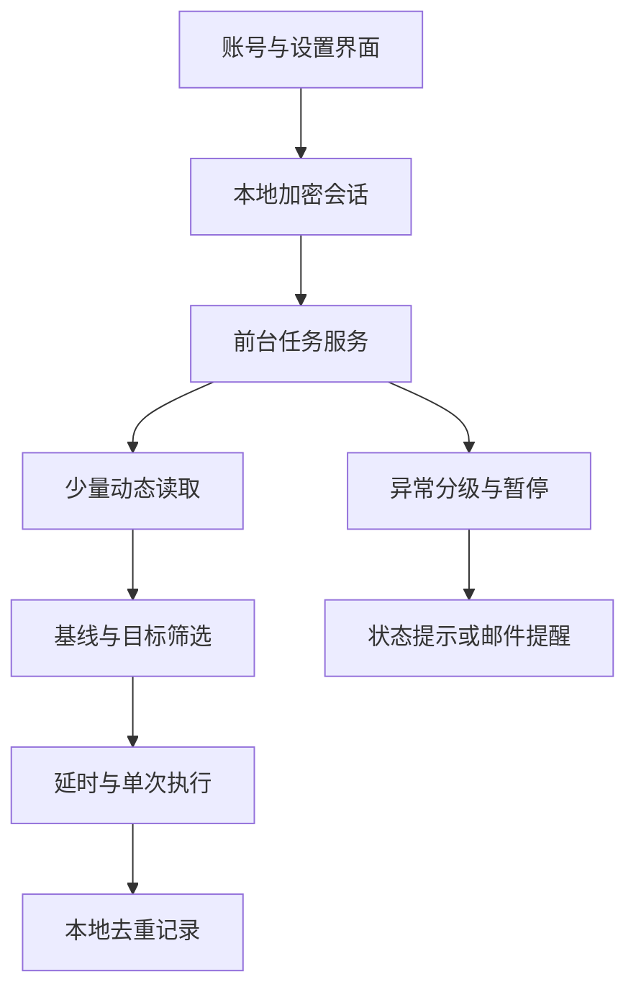

# 整体架构与运行流程

## 整体结构

项目采用单设备本地运行方式，各模块只交换完成任务所需的最少状态。

## 各模块负责什么

### 账号与设置界面

负责添加账号、展示脱敏账号信息、切换当前账号，以及启动、暂停和停止任务。

### 本地加密会话

只保存维持登录状态所需的信息。敏感内容使用 Android Keystore 保护，日志中不输出完整凭据。

### 前台任务服务

承担长期运行任务，并通过常驻通知让系统和使用者知道服务仍在工作。任务采用低频、随机化的检查间隔，避免密集请求。

### 动态读取与解析

每次只读取少量最新内容，再转换为内部统一的数据结构。公开文档不展示具体接口地址、完整字段映射或请求过程。

### 基线与目标筛选

首次启动记录当前已有内容，作为安全基线，不执行历史补处理。

后续内容需要依次通过以下判断：

1. 是否晚于当前基线。
2. 是否属于当前账号本人。
3. 是否为广告或无法识别内容。
4. 是否已经处理或已经具有目标状态。
5. 当前会话与服务状态是否允许执行。

### 延时与单次执行

目标通过筛选后等待一个较短的随机时间，再提交一次操作。结果明确时记录成功；结果不明确时记录状态并停止对该目标重复尝试。

### 本地去重记录

保存目标标识和处理结果，应用重启后仍能避免重复动作。运行记录与登录凭据分开保存。

### 异常分级与暂停

异常被分成三类：

- 明确异常：验证、登录失效或访问限制，立即暂停。
- 不确定异常：单次结果无法核实，跳过；连续发生时暂停。
- 临时异常：普通断网或超时，允许之后重新检查；持续失败时暂停。

## 一次完整运行

1. 使用者选择账号并启动前台任务。
2. 第一次读取只建立基线。
3. 后续按低频随机间隔读取少量最新内容。
4. 筛选出基线之后出现且符合条件的目标。
5. 随机等待后执行一次操作。
6. 重新检查结果并写入本地去重记录。
7. 发现异常时进入暂停状态，并在需要时发送一次提醒。

## 为什么不做实时监听

项目目标是减轻一个很小的重复任务，并不要求毫秒级响应。

低频轮询实现简单、资源占用可控，也能为异常判断和停止策略保留足够空间。对这个项目而言，可解释和可停止比追求极限速度更重要。
